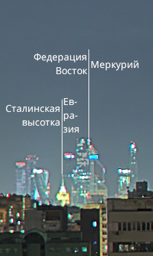
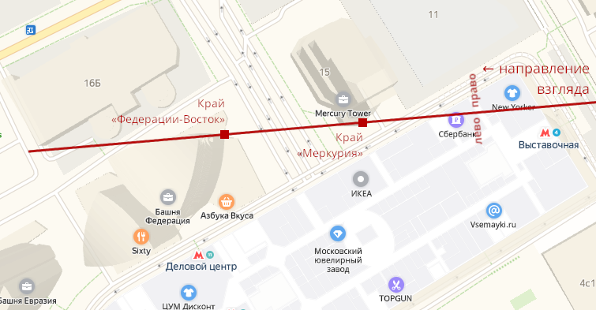
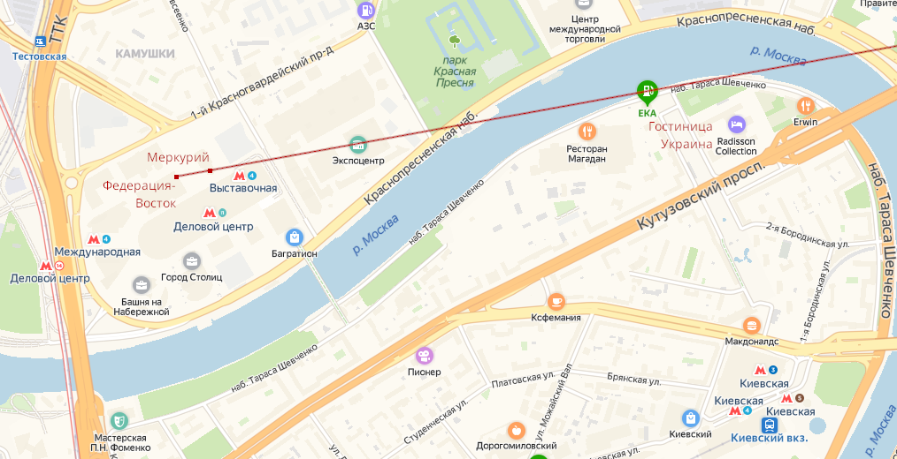
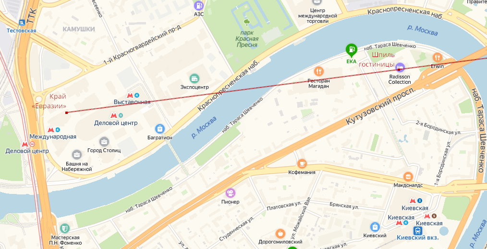
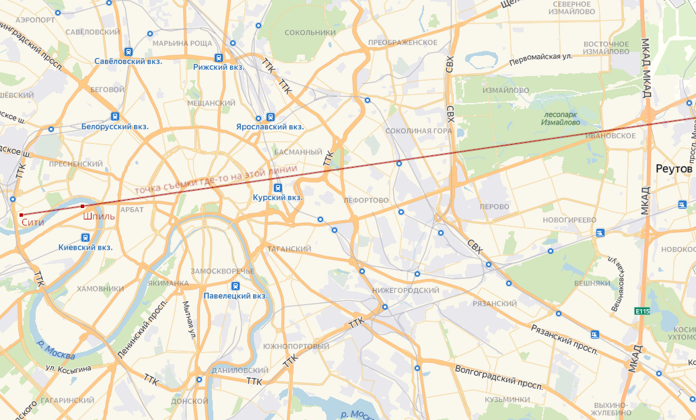
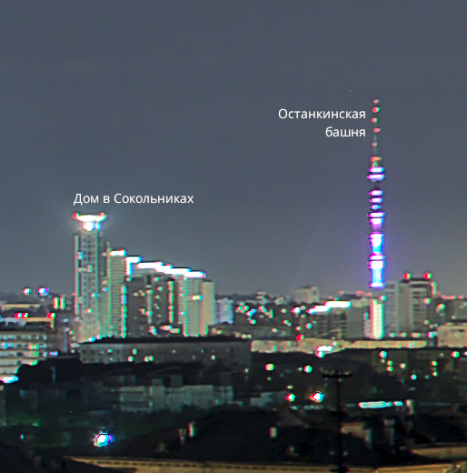
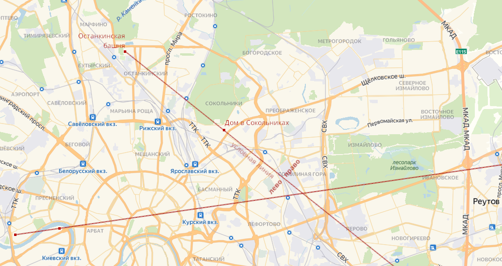
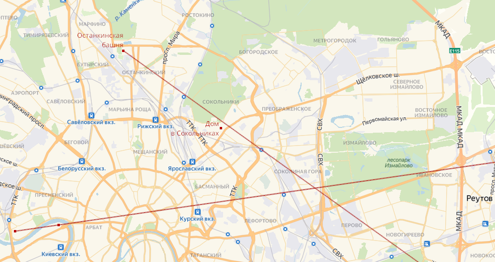
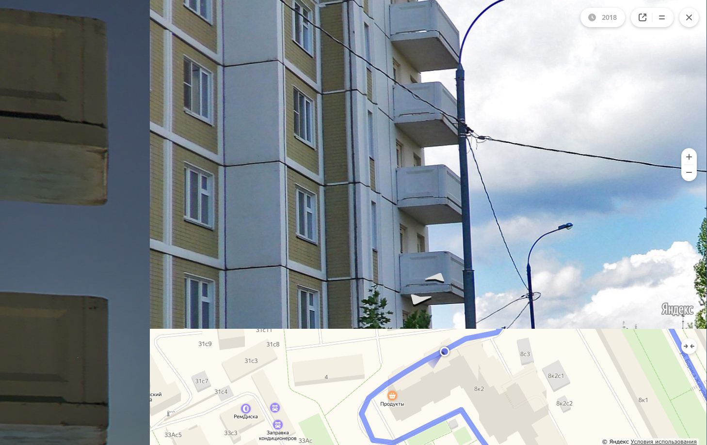

# Огни большого города: Write-up

Дана [фотография с балкона](app/IMG_2223.jpg), конверт с красной полосой и пятью штрих-кодами, а также проверяющая система.

В проверяющей системе указана целая часть координат — 55, 37. Значит, точку нужно искать в Москве. Требуется точность 150 метров, а количество попыток ограничено пятью штрих-кодами — перебрать не получится. В EXIF-метаданных файла координаты округлены до градусов.

Рассмотрим способ, основанный на следующем наблюдении: если какие-нибудь два далеко расположенных объекта оказались в одном месте панорамы, значит, оба эти объекта и точка съёмки находятся на одной прямой. Находя пары таких объектов, можно проводить через них линии на карте. Линии пересекутся в точке съёмки.

Первое место, заслуживающее внимания — Сити. Сити состоит из узнаваемых башен, и по их взаимному расположению можно хорошо определить направление. В одной точке панорамы оказались правый край самой высокой башни («Федерация-Восток») и левый край башни с диагональными крышами («Меркурий»).

Получившаяся линия не очень точная, но она позволяет понять, что оранжевый шпиль сталинской высотки на фоне Сити принадлежит зданию гостиницы Украина. На фотографии точно над этим шпилем находится грань башни «Евразия». Проведём линию через них:

Ещё один однозначно узнаваемый объект на панораме — Останкинская башня. На одной линии с ней — обычные дома, но рядом стоит выделяющееся здание со ступенчатой крышей. Его можно найти по картинке в [списке самых высоких зданий Москвы](https://ru.wikipedia.org/?oldid=99621293) на 37 месте, после чего по адресу отыскать на карте.

Рисовать точную линию не вполне корректно, ведь башня и дом находятся не точно на одной линии. Дом левее, значит, линия должна пройти немного выше него (впрочем, мы не знаем точно, насколько выше).

В установленной таким образом зоне поиска надо найти высокое здание с белыми балконами характерной формы. Высота зданий видна на спутниковых снимках или на картах Яндекса, если их пошевелить. Подходящих по высоте домов несколько, поэтому можно уточнить с помощью панорам форму балконов:

Итак, адрес дома — **8-я улица Соколиной Горы, 8к2**. Весь дом вписывается в 150-метровый круг, поэтому подойдут координаты любой точки в доме, например, **55.766954, 37.734877**. Отправляем координаты и штрих-код в проверяющую систему, получаем картинку с флагом:

Флаг: **ugra\_come\_to\_Moscow\_we\_have\_Sokol\_and\_Sokolniki\_and\_Sokolinaya\_Gora**

