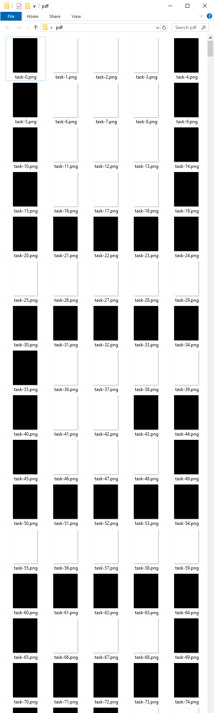

# Для слепых: Write-up

В PDF-файле только черные и белые страницы, никакой дополнительной информации, даже текста.

Замечаем, что очень часто наборы страниц повторяются группами по пять страниц. Попробуем глянуть на превьюшки страниц такими группами:

Аккуратно выписываем флаг.

Флаг: **ugra_preview**
