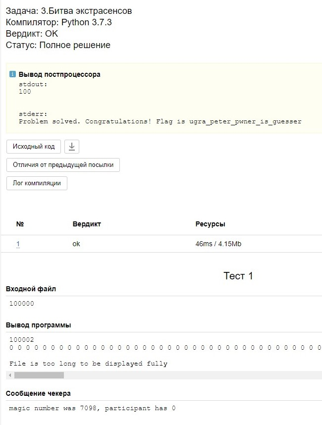

# Битва экстрасенсов: Write-up

Главная проблема задачи заключается в том, что предугадать случайное число чекера сложно. Или даже невозможно.

К счастью, у нас есть бинарный файл и мы можем это проверить. Открываем его в Ghidra или в IDA Pro (только если 
у вас лицензионный Hex-Rays), декомпилируем и видим код:

```c
stream = fopen("/dev/urandom", "r");
fread(&v7, 1uLL, 4uLL, stream);
fclose(stream);
```

Число читается из `/dev/urandom`, поэтому у нас нет шансов.

Присмотримся к бинарю внимательнее. Судя по количеству чтений, `argv[1]` — это файл с входными данными (там одно число *N*), а `argv[2]` — файл с ответом участника (там число *K* и массив).

Замечаем, что массив читается на стек, при этом перед чтением *K* никак не проверяется совсем. Единственная проверка находится после чтения массива.

Что же можно сделать, переполнив стек? Мы не сможем прыгнуть из функции куда-либо, поскольку есть канарейка (stack protector), а «взаимодействие» с чекером как таковое отсутствует — мы можем лишь дать ему файл с данными.

Однако, понимаем, что пользователю при корректном выходном файле возвращается значение переменной с результатом, которая изначально равнялась 1 (по всей видимости, это WA), а при выполнении условий задачи превращается в 0 (OK). И эта самая переменная находится через четыре байта после окончания массива!

Значит, видимо, при выводе 100 002 нулей мы сможем заполнить возвращаемое значение нулем и победить. Но на самом деле, что-то идет не так.

Замечаем, что между массивом и кодом выхода есть ещё одна переменная. В неё складываются результаты выполнения функции `fscanf`:

```c
v12 = fscanf(v6, "%d", arr[i]);
...
v13 += v12;
```

После чего проверяется, что переменная должна быть больше или равна *k*:

```c
if ( (signed int)v13 >= v9) {
    ...
```

Что же возвращает `fscanf`? Обратимся к документации:

> Number of receiving arguments successfully assigned (which may be zero in case a matching failure occurred before the first receiving argument was assigned), or EOF if input failure occurs before the first receiving argument was assigned.

Таким образом, для паттерна `%d` возвращаемое значение всегда 1. Тогда поступим просто: запишем в 100 001-й элемент очень большое число. Тогда оно будет заведомо больше *k* после прибавления оставшихся результатов `fscanf`. 

Снова не работает! Наконец, замечаем, что все числа должны быть не более *n*. Значит, подставим *n* на это место, и побеждаем.

Можно заметить, что в выводе чекер пишет, что число мы не угадали, но ответ всё равно считается верным.



Флаг: **ugra\_peter\_pwner\_is\_guesser**
